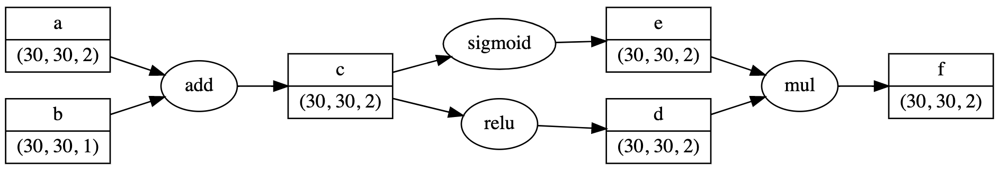
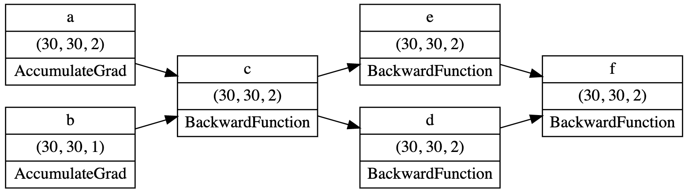

<h1 align="center">
  <br>
  nanograd
  <br>
</h1>

<h4 align="center">A lightweight deep learning framework.</h4>

<p align="center">
  
</p>

<p align="center">
  <a href="#description">Description</a> •
  <a href="#features">Features</a> •
  <a href="#todo">TODO</a> •
  <a href="#license">License</a>
</p>


## Description

After verification, nanograd is not a city in Russia...

However, it is a PyTorch-like lightweight deep learning framework. Use it to implement any DL algo you want with little boilerplate code.

Essentially, Nanograd is a continuously updated project. The goal is to implement as many features as possible while using as few abstraction layers as possible (only Numpy functions are allowed). Any contribution to the repo is welcome.

The library has a built-in auto-differentiation engine that dynamically builds a computational graph. The framework is built with basic features to train neural nets: basic ops, layers, weight initializers, optimizers and loss functions. Additional tools are developed to visualize your network: computational
graph visualizers or activation map visualizers (SOON!).

The repo will be updated regularly with new features and examples. 

Inspired from <a href="https://github.com/geohot/tinygrad">geohot's tinygrad</a>.


## Features

- PyTorch-like autodifferentiation engine (dynamically constructed computational graph)
- Weight initialization: Glorot uniform, Glorot normal, Kaiming uniform, Kaiming normal
- Activations: ReLU, Sigmoid, tanh, Swish, ELU, LeakyReLU
- Convolutions: Conv1d, Conv2d, MaxPool2d, AvgPool2d
- Layers: Linear, BatchNorm1d, BatchNorm2d, Flatten, Dropout
- Optimizers: SGD, Adam, AdamW
- Loss: CrossEntropyLoss, Mean squared error
- Computational graph visualizer (see example)

### A quick side-by-side comparison between PyTorch and Nanograd for tensor computations

#### Basic tensor calculations

**PyTorch**

```python
a = torch.empty((30, 30, 2))
         .normal_(mean=3, std=4)
b = torch.empty((30, 30, 1))
         .normal_(mean=10, std=2)

a.requires_grad = True
b.requires_grad = True

c = a + b
d = c.relu()
e = c.sigmoid()
f = d * e

f.sum().backward()

print(a.grad)
print(b.grad)
```

**Nanograd**

```python
a = Tensor.normal(3, 4, (30, 30, 2), requires_grad=True)
b = Tensor.normal(10, 2, (30, 30, 1), requires_grad=True)

c = a + b
d = c.relu()
e = c.sigmoid()
f = d * e

f.backward()

print(a.grad)
print(b.grad)
```


### Training a CNN on MNIST

```python

# Model, loss & optim
model = CNN()
loss_function = CrossEntropyLoss()
optim = SGD(model.parameters(), lr=0.01, momentum=0)

# Training loop
BS = 128
losses, accuracies = [], []
STEPS = 1000

for i in tqdm(range(STEPS), total=STEPS):
  samp = np.random.randint(0, X_train.shape[0], size=(BS))
  X = tensor.Tensor(X_train[samp])
  Y = tensor.Tensor(Y_train[samp])

  optim.zero_grad()

  out = model(X)

  cat = out.data.argmax(1)
  accuracy = (cat == Y.data).mean()

  loss = loss_function(out, Y)
  loss.backward()

  optim.step()

  loss, accuracy = float(loss.data), float(accuracy)
  losses.append(loss)
  accuracies.append(accuracy)

Y_test_preds = model(tensor.Tensor(X_test)).data.argmax(1)
print((Y_test == Y_test_preds).mean())

```


### Visualizing a computational graph 

Visualizing a computational graph has never been that easy. Just call **plot_forward** and **plot_backward**.

```python
f.plot_forward()
```

<p align="center">
  
</p>


```python
f.plot_backward()
```

<p align="center">
  
</p>

## TODO

- Solve batchnorm issues
- Add GRU, LSTM cells
- Code example with EfficientNet-B0, CIFAR-10, MNIST
- Code a transformer with Nanograd and train it on GPU


## License

MIT

---

> GitHub [@PABannier](https://github.com/PABannier) &nbsp;&middot;&nbsp;
> Twitter [@el_PA_B](https://twitter.com/el_PA_B)