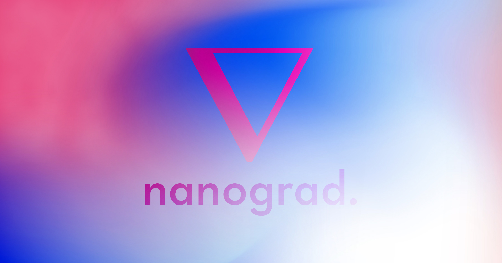

<h1 align="center">
   
  
   
  nanograd
   
</h1>

<h4 align="center">A lightweight deep learning framework.</h4>

  

  <a href="#description">Description</a> •
  <a href="#features">Features</a> •
  <a href="#todo">TODO</a> •
  <a href="#license">License</a>

## Description

After verification, nanograd is not a city in Russia...

However, it is a lightweight deep learning framework you should use for learning purposes.

The main objective is to implement any DL algo or model you want with as little boilerplate code as possible. The second objective is to create built-in visualization tools to better understand how a deep neural network trains (especially backprop).

The repo will be updated regularly with new features and examples.

Inspirations: nanograd was initially inspired by [geohot's tinygrad](https://github.com/geohot/tinygrad) and [CMU Deep Learning course](http://deeplearning.cs.cmu.edu/F20/index.html).

## Features

- PyTorch-like autodifferentiation engine (dynamically constructed computational graph)
- Activations: ReLU, Sigmoid, tanh
- Optimizers: SGD, Adam, AdamW
- Weight initialization: Glorot uniform, Glorot normal, Kaiming uniform, Kaiming normal
- Loss: CrossEntropyLoss
- Fully-working example with MNIST (96% validation accuracy)

## TODO

- Improve comments and documentation
- Cython support for CPU (maybe ???)
- GPU support
- Convolutions: Conv1D, Conv2D, Flatten, MaxPool and AveragePooling
- Resblocks
- Attention mechanism for computer vision (CBAM), Transformer...
- Visualization tool
- Schedulers: Warmup, Cosine Annealing, 
- Interpretability tools: GradCAM, ...

## License

MIT

---

> GitHub [@PABannier](https://github.com/PABannier) &nbsp;&middot;&nbsp;
> Twitter [@el_PA_B](https://twitter.com/el_PA_B)